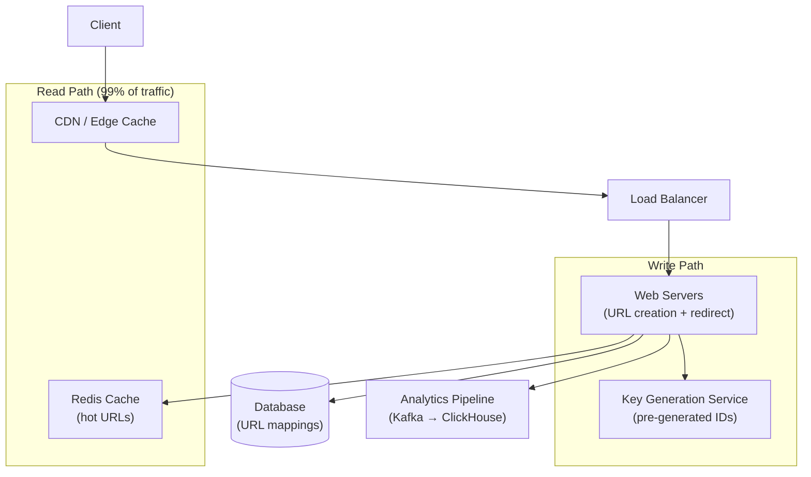
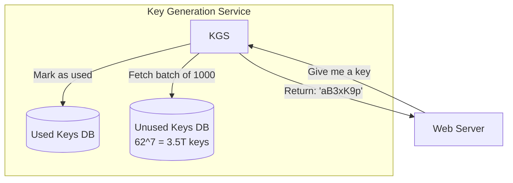
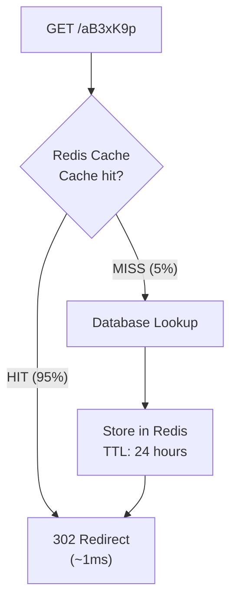
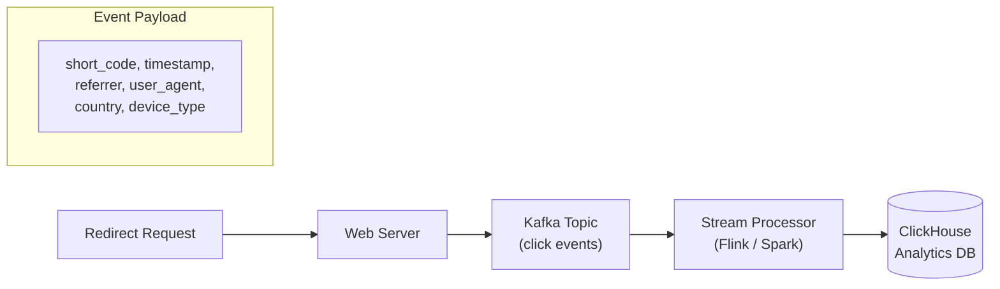

## Learning Objectives

- Design a URL shortening service handling billions of redirects per month
- Evaluate ID generation strategies: base62 encoding, hashing, pre-generated keys
- Optimize for read-heavy workloads with caching and CDN strategies
- Handle hash collisions, custom aliases, and URL expiration
- Estimate capacity requirements for storage, bandwidth, and QPS

## Prerequisites

- Understanding of hashing, encoding, and database design
- Familiarity with caching strategies and CDN architecture
- Knowledge of load balancing and horizontal scaling

## Requirements Gathering

### Functional Requirements

1. Given a long URL, generate a short unique URL
2. Redirect short URL to the original long URL
3. Optional: custom short aliases (`bit.ly/my-brand`)
4. Optional: URL expiration (default 5 years)
5. Optional: analytics (click count, referrer, geo)

### Non-Functional Requirements

- **Read-heavy**: 100:1 read-to-write ratio
- **Low latency**: Redirects under 50ms (p99)
- **High availability**: 99.99% uptime
- **Non-guessable**: Short URLs shouldn't be predictable

### Capacity Estimation

```
Write volume: 100M new URLs/month = ~40 URLs/sec
Read volume:  100:1 ratio = 10B redirects/month = ~4,000 redirects/sec
Peak: 3-5x average = ~20,000 redirects/sec

Storage (5-year retention):
  100M URLs/month × 60 months = 6B URLs
  Average URL length: 100 bytes + 7 bytes short code + metadata = ~500 bytes
  6B × 500 bytes = 3 TB

Bandwidth:
  Redirects: 20K RPS × 500 bytes = 10 MB/s (trivial)
  Outgoing redirects: 301/302 responses are tiny (~200 bytes)
```

## High-Level Architecture



## Short URL Generation

### Approach 1: Base62 Encoding

Convert a numeric ID to a base62 string (a-z, A-Z, 0-9):

```
Alphabet: abcdefghijklmnopqrstuvwxyzABCDEFGHIJKLMNOPQRSTUVWXYZ0123456789

ID: 123456789
Base62: "8M0kX"

Short URL length math:
  62^6 = 56.8 billion combinations (6 chars)
  62^7 = 3.5 trillion combinations (7 chars)
  → 7 characters is more than enough for billions of URLs
```

```python
CHARSET = "abcdefghijklmnopqrstuvwxyzABCDEFGHIJKLMNOPQRSTUVWXYZ0123456789"
BASE = len(CHARSET)

def encode(num):
    if num == 0:
        return CHARSET[0]
    result = []
    while num > 0:
        result.append(CHARSET[num % BASE])
        num //= BASE
    return ''.join(reversed(result))

def decode(short_code):
    num = 0
    for char in short_code:
        num = num * BASE + CHARSET.index(char)
    return num
```

**Problem**: Sequential IDs make URLs predictable. `short.ly/abc123` → `short.ly/abc124` is the next URL.

**Solution**: Use a **Snowflake-like distributed ID generator** with timestamp + worker ID + sequence, then base62 encode it.

### Approach 2: MD5/SHA256 Hash + Truncate

```
hash = MD5("https://example.com/very-long-path")
     = "5d41402abc4b2a76b9719d911017c592"
short_code = hash[:7] = "5d41402"
```

**Problem**: Collisions. Different URLs can produce the same 7-character prefix.

**Solution**: Check for collision → if exists, append a counter and rehash → check again.

### Approach 3: Pre-Generated Key Service (KGS)

Generate all possible 7-character keys in advance and store them in a database. When a URL needs shortening, take the next unused key:



**Key insight**: The KGS keeps a buffer of keys in memory, serving them instantly. Keys are moved from `unused` to `used` atomically. No collision checking needed.

**Concurrency**: Multiple servers can each get their own batch of keys (1,000 at a time), avoiding contention.

## Database Design

### Schema

```sql
CREATE TABLE urls (
    id          BIGINT PRIMARY KEY,
    short_code  CHAR(7) UNIQUE NOT NULL,
    long_url    TEXT NOT NULL,
    user_id     BIGINT,
    created_at  TIMESTAMP DEFAULT NOW(),
    expires_at  TIMESTAMP,
    click_count BIGINT DEFAULT 0
);

CREATE INDEX idx_short_code ON urls(short_code);
CREATE INDEX idx_expires_at ON urls(expires_at) WHERE expires_at IS NOT NULL;
```

### SQL vs. NoSQL?

| Factor | SQL (PostgreSQL) | NoSQL (DynamoDB) |
|--------|-----------------|-----------------|
| **Access pattern** | Point lookup by short_code | Point lookup by short_code |
| **Scale** | 3 TB is manageable | Easily handles 3 TB+ |
| **Schema** | Fixed, simple | Key-value, simpler |
| **Analytics queries** | Better with JOINs | Separate analytics DB |

Either works. For simplicity, start with PostgreSQL. If you need to scale beyond one server, DynamoDB or Cassandra with `short_code` as the partition key.

## Read Path Optimization

### Caching Strategy



**Cache sizing**:
```
Hot URLs: 20% of URLs get 80% of traffic (Pareto principle)
6B URLs × 20% = 1.2B URLs to cache
1.2B × 200 bytes = 240 GB → Fits in Redis Cluster

Cache hit ratio target: 95%+
Redirect latency with cache hit: <5ms
```

### CDN for Popular URLs

Extremely popular URLs (viral content) can be cached at the CDN edge:

```http
HTTP/1.1 301 Moved Permanently
Location: https://example.com/original-url
Cache-Control: public, max-age=3600
```

Using `301` (permanent) allows browsers and CDNs to cache the redirect. Using `302` (temporary) ensures every redirect goes through your servers (needed for analytics).

**Trade-off**: 301 reduces server load but you lose analytics accuracy. 302 gives accurate analytics but more server hits.

## Handling Edge Cases

### Custom Aliases

```
POST /api/urls
{
  "long_url": "https://example.com/campaign",
  "custom_alias": "summer-sale"
}

Validation:
  - Length: 3-30 characters
  - Characters: alphanumeric + hyphens
  - Not reserved: "api", "admin", "health"
  - Not taken: CHECK unique constraint
```

### URL Expiration

Run a background job to clean up expired URLs:

```sql
-- Batch delete expired URLs
DELETE FROM urls
WHERE expires_at < NOW()
AND expires_at IS NOT NULL
LIMIT 10000;
```

Or use a lazy approach: check expiration on read and return 410 Gone if expired. Clean up in background.

### Rate Limiting

Prevent abuse (someone generating millions of URLs):

```
Anonymous: 10 URLs/hour (by IP)
Authenticated: 100 URLs/hour (by user)
Enterprise: 10,000 URLs/hour (by API key)
```

## Analytics System



Analytics events are published asynchronously to Kafka, ensuring the redirect path stays fast. Aggregations (clicks per day, top referrers, geographic distribution) run in a separate analytics database like ClickHouse.

## Scaling Strategy

```
Stage 1 (0-1M URLs): Single PostgreSQL + Redis + 2 app servers
Stage 2 (1M-100M URLs): Read replicas, Redis Cluster, 5 app servers
Stage 3 (100M-1B URLs): Database sharding by short_code, KGS, 20 app servers
Stage 4 (1B+ URLs): Multi-region, CDN caching, dedicated analytics pipeline
```

## Interview Approach

1. **Clarify requirements**: Read:write ratio, custom aliases, analytics, expiration
2. **Estimate capacity**: QPS, storage, bandwidth (back-of-envelope)
3. **Design the core**: Short code generation + database + redirect service
4. **Optimize reads**: Caching (Redis), CDN for popular URLs
5. **Handle edge cases**: Collisions, custom aliases, expiration, rate limiting
6. **Add analytics**: Async event pipeline (Kafka → ClickHouse)
7. **Scale**: Database sharding, multi-region, KGS for ID generation

## Key Takeaways

1. **Pre-generated keys eliminate collisions**: KGS is the cleanest approach for short code generation.
2. **Cache aggressively**: 95%+ cache hit ratio is achievable. Most reads never hit the database.
3. **301 vs. 302 is a business decision**: 301 saves server resources; 302 enables accurate analytics.
4. **Base62 gives short URLs**: 7 characters = 3.5 trillion possible URLs.
5. **Analytics should be async**: Never slow down the redirect path for analytics tracking.
6. **Start simple**: A single PostgreSQL instance handles billions of URLs before you need sharding.

## External Resources

- [System Design: URL Shortener (Grokking)](https://www.designgurus.io/course-play/grokking-the-system-design-interview/doc/638c0b5dac93e7ae59a1af69)
- [How bit.ly Works](https://bitly.com/blog/)
- [Base62 Encoding](https://en.wikipedia.org/wiki/Base62)
- [Twitter Snowflake ID Generator](https://blog.twitter.com/engineering/en_us/a/2010/announcing-snowflake)
- [ClickHouse for Analytics](https://clickhouse.com/docs)
