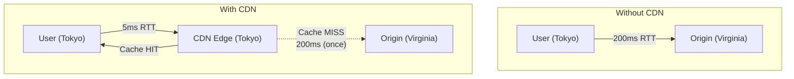
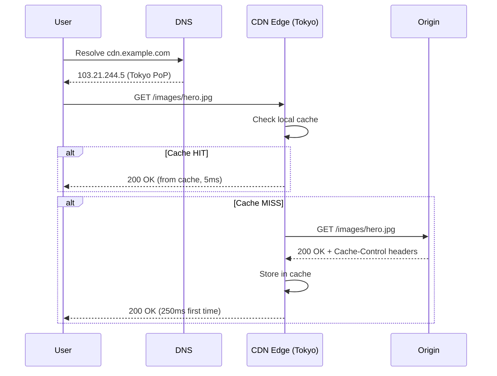
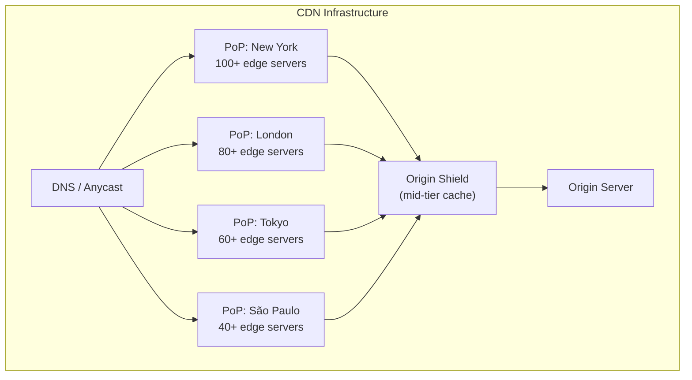
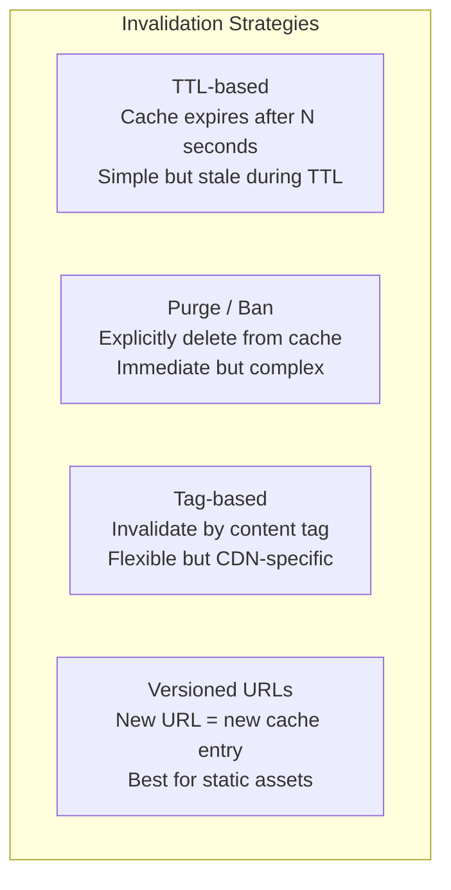
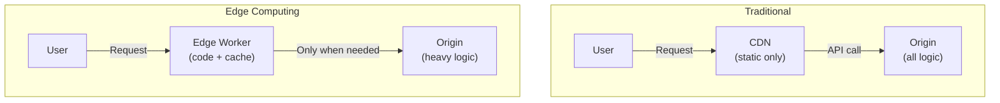
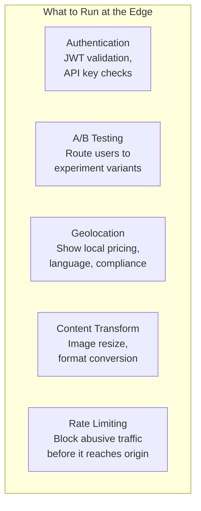
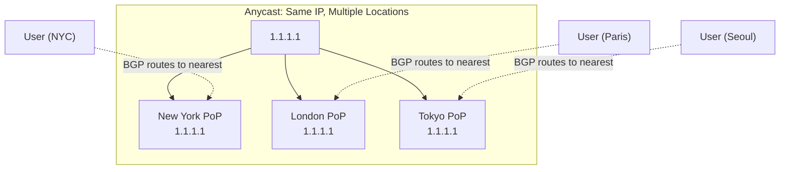
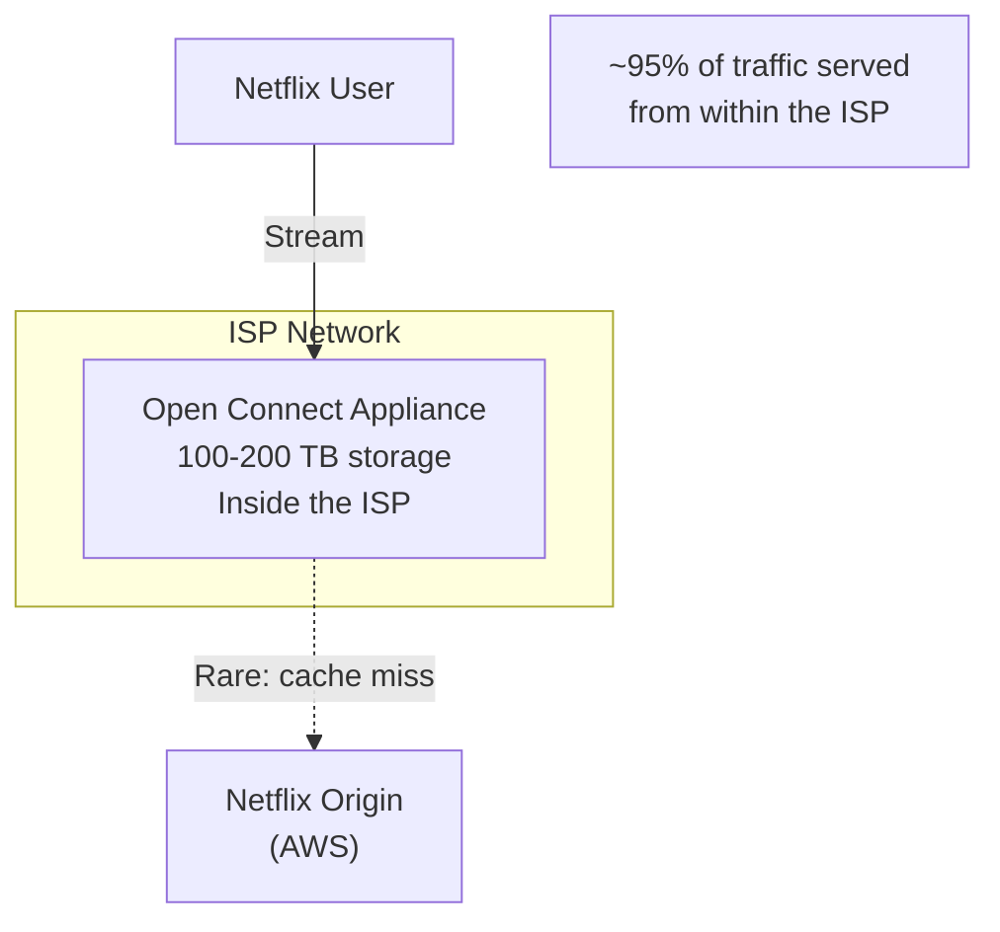

## Learning Objectives

- Explain CDN architecture and how content is served from edge locations
- Compare cache invalidation strategies and their trade-offs
- Design edge computing solutions for latency-critical applications
- Evaluate DNS-based routing and anycast for global traffic distribution
- Analyze CDN providers (Cloudflare, CloudFront, Akamai) and their differentiators

## Prerequisites

- Understanding of load balancing and DNS fundamentals
- Familiarity with caching strategies and HTTP cache headers
- Knowledge of client-server architecture and network latency

## What Is a CDN?

A Content Delivery Network is a **globally distributed network of servers** that caches content close to end users, reducing latency and offloading traffic from the origin server.



**Impact**: A page that loads in 3 seconds from Virginia might load in 500ms from a nearby edge server. For a global audience, CDNs are essential.

## CDN Architecture

### How a CDN Request Works



### CDN Components



**Point of Presence (PoP)**: A physical location with edge servers. Major CDNs have 200-300+ PoPs worldwide.

**Origin Shield**: A mid-tier cache between edge PoPs and the origin. Collapses multiple edge misses into a single origin request, protecting the origin from thundering herds.

## Content Types and Caching

### What CDNs Cache

| Content Type | Cacheability | TTL | Examples |
|-------------|-------------|-----|---------|
| **Static assets** | Highly cacheable | Days-Years | Images, CSS, JS, fonts |
| **API responses** | Conditionally | Seconds-Minutes | Product listings, public data |
| **HTML pages** | Varies | Seconds-Hours | Blog posts, landing pages |
| **Personalized content** | Not cacheable | N/A | User dashboards, carts |
| **Video/streaming** | Cacheable | Hours-Days | Video chunks, HLS segments |

### Cache-Control Headers

```http
# Static asset (cache for 1 year, immutable)
Cache-Control: public, max-age=31536000, immutable

# API response (cache for 60 seconds, revalidate after)
Cache-Control: public, max-age=60, stale-while-revalidate=30

# Private content (no CDN caching, browser only)
Cache-Control: private, no-store

# HTML page (short cache, always revalidate)
Cache-Control: public, max-age=0, must-revalidate
ETag: "abc123"
```

**Content hashing**: The best strategy for static assets. Include a hash in the filename (`app.a1b2c3.js`), set `max-age` to 1 year. When the file changes, the hash changes, and the old cached version is never requested again.

## Cache Invalidation

### The Hard Problem

> "There are only two hard things in Computer Science: cache invalidation and naming things." — Phil Karlton



### Strategy Comparison

**TTL-based**: Set `Cache-Control: max-age=300`. Content may be stale for up to 5 minutes. Simplest approach.

**Purge API**: Call the CDN's API to delete specific URLs from all edge caches.

```bash
# Cloudflare purge
curl -X POST "https://api.cloudflare.com/client/v4/zones/ZONE_ID/purge_cache" \
  -H "Authorization: Bearer API_TOKEN" \
  -d '{"files": ["https://example.com/api/products"]}'
```

**Tag-based invalidation**: Associate content with tags, then invalidate by tag.

```
# Tag content at cache time
Surrogate-Key: product-123 electronics featured

# Invalidate all content tagged "product-123"
→ Product page, listing page, search results all invalidated
```

**Versioned URLs**: `app.v2.1.0.js` → `app.v2.2.0.js`. Old version stays cached (and unused). New version fetched fresh. Zero staleness.

### Stale-While-Revalidate

A powerful pattern: serve stale content while fetching fresh content in the background:

```
Cache-Control: max-age=60, stale-while-revalidate=300

Timeline:
  t=0:   Cache populated (fresh)
  t=60:  Cache stale, but serves stale content instantly
         Background: fetch fresh content from origin
  t=61:  Cache updated with fresh content
  t=360: Cache truly expired, must wait for origin
```

This gives the speed of aggressive caching with the freshness of short TTLs.

## Edge Computing

### Moving Computation to the Edge

Instead of just caching content, run code at edge locations:



### Edge Worker Platforms

| Platform | Runtime | Cold Start | Use Cases |
|----------|---------|-----------|-----------|
| **Cloudflare Workers** | V8 isolates | 0ms | Auth, A/B testing, API routing |
| **AWS Lambda@Edge** | Node.js, Python | ~5-50ms | Image optimization, redirects |
| **AWS CloudFront Functions** | JavaScript | <1ms | Header manipulation, URL rewrite |
| **Vercel Edge Functions** | V8 isolates | 0ms | Dynamic SSR, personalization |
| **Deno Deploy** | V8 isolates | 0ms | Full applications |

### Edge Use Cases



**Example: Personalized content at the edge**

```javascript
// Cloudflare Worker: personalize response based on location
export default {
  async fetch(request) {
    const country = request.cf.country;
    const cacheKey = `${request.url}:${country}`;

    const cached = await caches.default.match(cacheKey);
    if (cached) return cached;

    const response = await fetch(request.url, {
      headers: { 'X-User-Country': country }
    });

    const modified = new Response(response.body, response);
    modified.headers.set('Cache-Control', 'public, max-age=3600');
    await caches.default.put(cacheKey, modified.clone());

    return modified;
  }
};
```

## DNS-Based Routing

### GeoDNS

Return different IP addresses based on the client's location:

```
User in Tokyo resolves cdn.example.com:
  → 103.21.244.5 (Tokyo PoP)

User in London resolves cdn.example.com:
  → 198.41.222.3 (London PoP)

User in São Paulo resolves cdn.example.com:
  → 190.93.244.7 (São Paulo PoP)
```

### Anycast vs. Unicast

**Unicast**: One IP → one server. Traditional routing.

**Anycast**: One IP → multiple servers worldwide. The network routes to the **nearest** server (by BGP metrics):



**Cloudflare** uses anycast for its entire network. Every one of their 300+ PoPs announces the same IP ranges. No DNS-based routing needed.

## Real-World CDN Architectures

### Netflix Open Connect

Netflix doesn't use a traditional CDN. They built **Open Connect** — custom hardware deployed inside ISP networks:



Netflix stores the most popular content on appliances inside ISPs. Users stream from hardware literally in their ISP's datacenter — minimal hops, maximum bandwidth.

### Twitter / X

Twitter's CDN strategy for media:
- User uploads image → stored in origin (blob storage)
- First request → cache miss, fetch from origin, cache at edge
- Viral tweet → image cached at all PoPs, served from edge
- Profile pictures → long TTL (change rarely), high cache hit ratio
- Timeline API → not CDN-cached (personalized, real-time)

## CDN Provider Comparison

| Feature | Cloudflare | CloudFront | Akamai |
|---------|-----------|------------|--------|
| **PoPs** | 300+ | 400+ | 4,100+ |
| **Edge compute** | Workers (V8) | Lambda@Edge | EdgeWorkers |
| **DDoS protection** | Built-in | AWS Shield | Built-in |
| **WAF** | Built-in | AWS WAF | Built-in |
| **Pricing** | Bandwidth-included | Pay-per-GB | Enterprise contracts |
| **Best for** | Developer experience | AWS ecosystem | Enterprise, media |

## Capacity Estimation

For a media-heavy application (10M DAU, 50 requests/user/day):

```
Total requests: 10M × 50 = 500M requests/day
Peak RPS: 500M / 86,400 × 3 (peak factor) ≈ 17,000 RPS

CDN cache hit ratio: 90% (typical for static content)
Origin requests: 500M × 10% = 50M/day = ~580 RPS

Bandwidth:
  Average response: 200KB (images, JS, CSS)
  500M × 200KB × 90% (CDN-served) = ~84 TB/day from CDN
  CDN bandwidth: ~8 Gbps average, ~24 Gbps peak

Origin bandwidth: ~840 GB/day (10% of total)
  Much more manageable!
```

## Interview Approach

1. **Put a CDN first**: "Static assets (images, CSS, JS) are served from a CDN like CloudFront"
2. **Explain cache strategy**: "We use content hashing for immutable assets and short TTLs with stale-while-revalidate for API responses"
3. **Address invalidation**: "For product updates, we purge the CDN cache via API and use surrogate keys for tag-based invalidation"
4. **Consider edge compute**: "We validate JWTs and do rate limiting at the edge to reduce origin load"
5. **Mention origin shield**: "An origin shield layer collapses cache misses, protecting our origin during traffic spikes"

## Key Takeaways

1. **CDN is layer 1 of scaling**: For any user-facing system, put static content on a CDN first.
2. **Cache invalidation needs a strategy**: Content hashing for assets, TTL + stale-while-revalidate for dynamic content, purge API for urgent updates.
3. **Origin shield protects your backend**: Without it, a cache expiry storm can take down your origin.
4. **Edge computing reduces latency**: Run auth, A/B testing, and personalization at the edge for sub-10ms responses.
5. **Anycast simplifies global routing**: One IP, nearest PoP. No complex DNS configuration needed.
6. **Measure cache hit ratio**: Target 90%+ for static content. Below 80% means your caching strategy needs work.

## External Resources

- [Cloudflare Learning Center — CDN](https://www.cloudflare.com/learning/cdn/what-is-a-cdn/)
- [AWS CloudFront Documentation](https://docs.aws.amazon.com/AmazonCloudFront/latest/DeveloperGuide/)
- [Netflix Open Connect](https://openconnect.netflix.com/)
- [Cloudflare Workers Documentation](https://developers.cloudflare.com/workers/)
- [Web Performance with CDNs (web.dev)](https://web.dev/articles/content-delivery-networks)
- [Akamai CDN Architecture](https://www.akamai.com/why-akamai)
