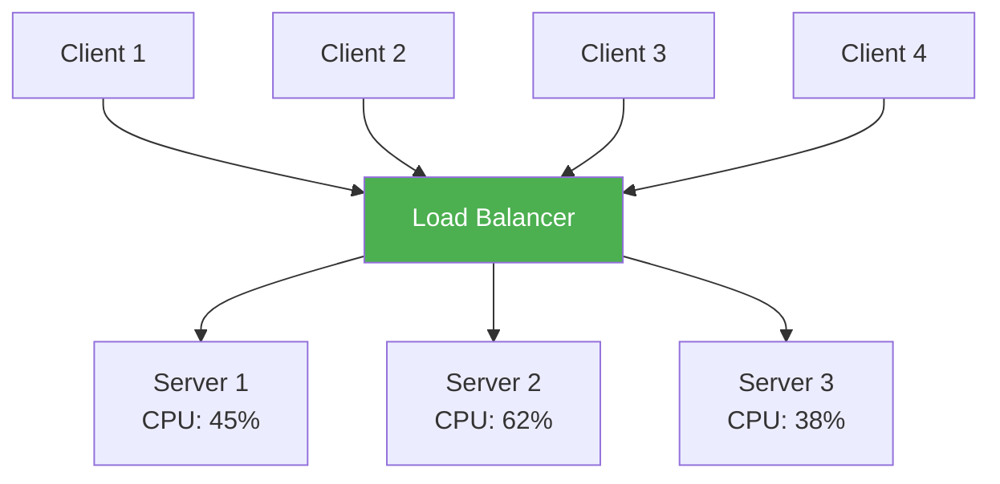
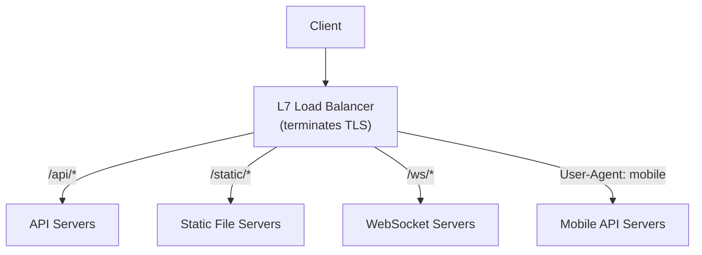
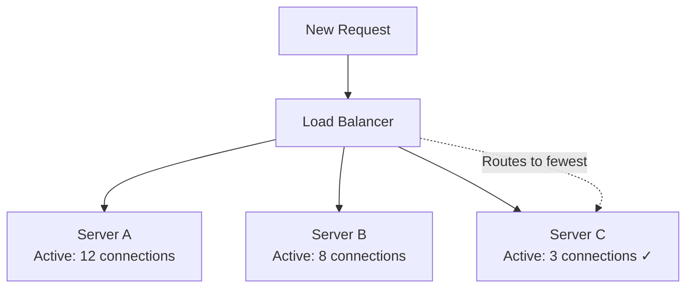
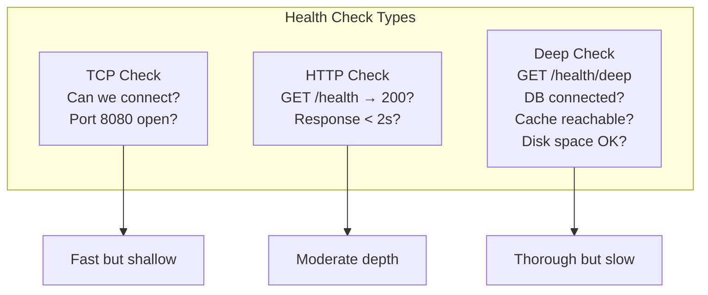
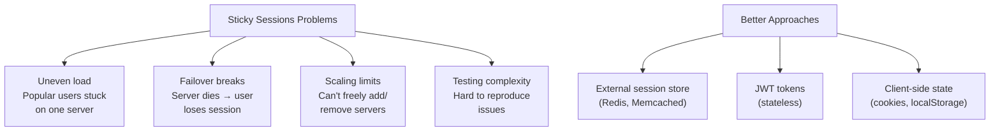
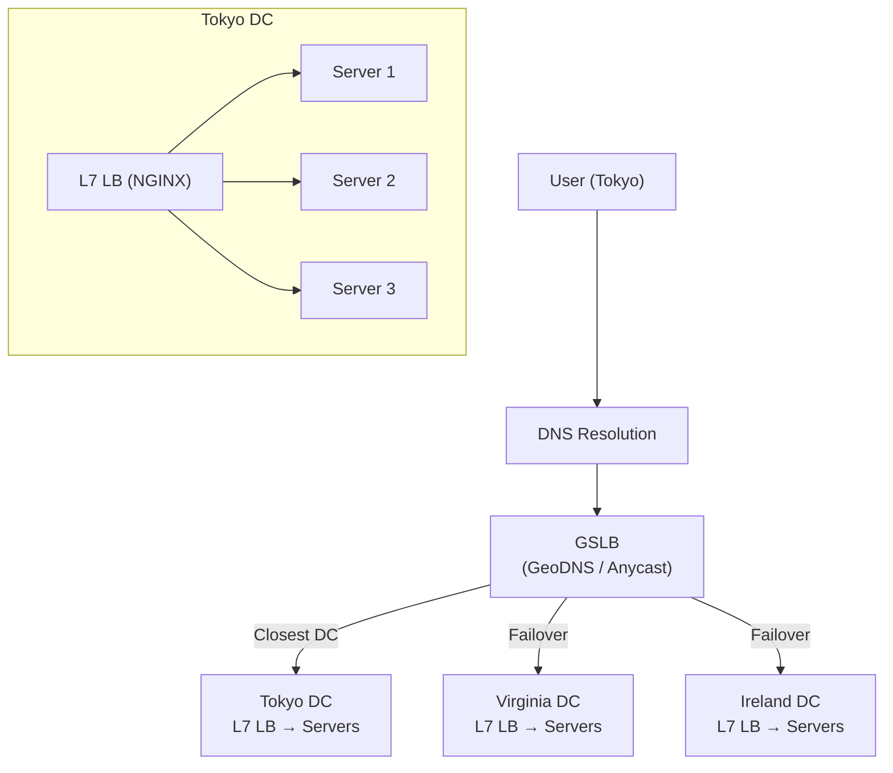
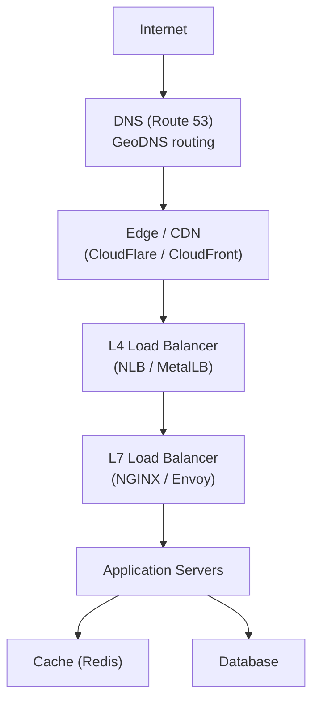

## Learning Objectives

- Compare Layer 4 and Layer 7 load balancing and their appropriate use cases
- Evaluate load balancing algorithms: round-robin, least connections, consistent hashing
- Design health checking mechanisms for backend server pools
- Implement sticky sessions and understand their trade-offs
- Architect multi-tier load balancing with DNS, global, and local load balancers

## Prerequisites

- Understanding of TCP/IP networking basics and the OSI model
- Familiarity with HTTP protocol and web server architecture
- Knowledge of horizontal scaling concepts

## What Is a Load Balancer?

A load balancer distributes incoming traffic across multiple servers to ensure no single server is overwhelmed.



Without a load balancer, all traffic hits one server. With a load balancer, you get fault tolerance, scalability, and better resource utilization.

## Layer 4 vs. Layer 7

### Layer 4 (Transport Layer)

Operates at the TCP/UDP level. Makes routing decisions based on **IP address and port** without inspecting the application payload.

```
Client → L4 LB → Backend
  
What L4 sees:
  Source IP: 203.0.113.50
  Dest IP: 10.0.1.100 (VIP)
  Source Port: 52413
  Dest Port: 443
  Protocol: TCP

What L4 does NOT see:
  HTTP method, URL path, headers, cookies, body
```

**How it works**: The load balancer rewrites the destination IP/port (NAT) or forwards the TCP connection (DSR — Direct Server Return). It doesn't terminate TLS or inspect HTTP.

**Pros**: Extremely fast (hardware-accelerated, millions of connections/sec), protocol-agnostic.

**Cons**: Can't route based on content (URL, headers), can't do SSL termination at the LB, no content-based health checks.

### Layer 7 (Application Layer)

Operates at the HTTP/HTTPS level. Inspects request content to make intelligent routing decisions.



**What L7 can inspect**: URL path, HTTP method, headers (Host, Cookie, Authorization), request body, gRPC service name.

**Pros**: Content-based routing, SSL termination, request/response modification, caching, WAF integration, connection multiplexing.

**Cons**: Higher latency (must parse HTTP), higher resource usage, limited to HTTP(S)/gRPC.

### When to Use Which

| Scenario | L4 | L7 |
|----------|----|----|
| TCP passthrough (database, Redis) | ✓ | |
| Content-based routing | | ✓ |
| SSL termination | | ✓ |
| WebSocket routing | | ✓ |
| Ultra-high throughput (>1M conn/sec) | ✓ | |
| A/B testing, canary deployments | | ✓ |
| gRPC load balancing | | ✓ |

## Load Balancing Algorithms

### Round Robin

Distribute requests sequentially across servers:

```
Request 1 → Server A
Request 2 → Server B
Request 3 → Server C
Request 4 → Server A  (cycle repeats)
```

**Pros**: Simple, even distribution when servers are identical.
**Cons**: Doesn't account for server load or request complexity. If Server A is processing a heavy query, it still gets the next request.

### Weighted Round Robin

Assign weights based on server capacity:

```
Server A (weight 5): Gets 5 out of every 8 requests
Server B (weight 2): Gets 2 out of every 8 requests
Server C (weight 1): Gets 1 out of every 8 requests
```

Useful when servers have different hardware specs (e.g., during a rolling upgrade with old and new machines).

### Least Connections

Route to the server with the fewest active connections:



**Best for**: Long-lived connections (WebSockets, database proxies), requests with variable processing time.

### Least Response Time

Route to the server with the fastest recent response time. Combines least connections with response latency.

**Best for**: Heterogeneous backends where some servers are consistently faster.

### IP Hash

Hash the client IP to deterministically route to a server:

```
hash(client_ip) % number_of_servers = server_index

Advantage: Same client always hits the same server
           (poor person's sticky sessions)
```

### Consistent Hashing

Uses a hash ring (see Data Partitioning lesson) to minimize redistribution when servers are added or removed. Used by Envoy proxy and many service meshes.

## Health Checks

### Types of Health Checks



### Health Check Configuration

```nginx
# NGINX upstream health checks
upstream backend {
    server 10.0.1.1:8080 max_fails=3 fail_timeout=30s;
    server 10.0.1.2:8080 max_fails=3 fail_timeout=30s;
    server 10.0.1.3:8080 max_fails=3 fail_timeout=30s backup;
}
```

```yaml
# HAProxy health check
backend app_servers
    option httpchk GET /health
    http-check expect status 200
    server web1 10.0.1.1:8080 check inter 5s fall 3 rise 2
    server web2 10.0.1.2:8080 check inter 5s fall 3 rise 2
```

**Key parameters**:
- **Interval**: How often to check (5-30 seconds)
- **Fall threshold**: How many consecutive failures before marking unhealthy (2-5)
- **Rise threshold**: How many successes before marking healthy again (2-3)
- **Timeout**: Max time to wait for a health check response (2-5 seconds)

### Graceful Degradation

A server returning degraded health (`HTTP 503`) should be treated differently from a server that's unreachable:

```
Healthy (200): Accept new connections, full traffic
Draining (503): Stop sending new connections, finish existing ones
Unreachable (timeout): Remove from pool immediately
```

## Sticky Sessions (Session Affinity)

### The Problem

Stateful applications store session data on the server. If a user's requests go to different servers, they lose their session:

```
Request 1 → Server A: Login, session stored on A
Request 2 → Server B: "Who are you?" (no session!)
```

### Sticky Session Mechanisms

**Cookie-based**: Load balancer inserts a cookie identifying the backend server.

```
Response from LB: Set-Cookie: SERVERID=server_a; Path=/
Subsequent requests include: Cookie: SERVERID=server_a
→ LB routes to server_a
```

**IP-based**: Hash the client IP to a server (unreliable with NAT/proxies).

### Why to Avoid Sticky Sessions



> **Interview Tip**: Always prefer stateless services with external session storage over sticky sessions. Mention that you'd use Redis for session data so any server can handle any request.

## Multi-Tier Load Balancing

### Global Server Load Balancing (GSLB)



**DNS-based GSLB**: Return different IP addresses based on the client's geographic location. CloudFlare, AWS Route 53, and Google Cloud DNS all support this.

**Anycast**: Advertise the same IP address from multiple locations. The network routes traffic to the nearest one (used by CDNs and DNS services).

### Production Architecture

A typical production setup has three layers:



## HAProxy vs. NGINX vs. Envoy

| Feature | HAProxy | NGINX | Envoy |
|---------|---------|-------|-------|
| **L4 support** | Excellent | Good | Excellent |
| **L7 support** | Good | Excellent | Excellent |
| **Config reload** | Zero-downtime | Zero-downtime | Hot restart |
| **Service mesh** | No | No (NGINX unit) | Yes (Istio sidecar) |
| **gRPC** | Yes | Yes | Native |
| **Observability** | Stats page | Stub status | Prometheus native |
| **Best for** | TCP/HTTP LB | Web serving + LB | Service mesh, gRPC |

### Cloud Load Balancers

| Cloud | L4 | L7 | Global |
|-------|----|----|--------|
| **AWS** | NLB | ALB | Global Accelerator |
| **GCP** | Network LB | HTTP(S) LB | Cloud CDN + LB |
| **Azure** | Azure LB | App Gateway | Front Door |

## Capacity Estimation

For a web application serving 100K requests/second:

```
L7 load balancer sizing:
  NGINX: ~50K-100K RPS per instance (4 cores, 8GB RAM)
  → Need 1-2 NGINX instances (with redundancy: 4 instances)

  HAProxy: ~100K-200K RPS per instance
  → Need 1 HAProxy instance (with redundancy: 2 instances)

Connection limits:
  Each server handles ~5000-10000 concurrent connections
  100K RPS with 100ms avg response time = 10K concurrent connections
  → 2-3 backend servers minimum

Bandwidth:
  Average response size: 50KB
  100K × 50KB = 5 GB/s = 40 Gbps
  → Need 10Gbps NICs on LB, consider SSL offload
```

## Interview Approach

When discussing load balancers in a system design interview:

1. **Start with a single L7 LB**: "We'll place an NGINX load balancer in front of our application servers"
2. **Explain the algorithm**: "Round-robin for stateless services, least-connections for WebSocket servers"
3. **Add health checks**: "Active HTTP health checks every 10 seconds, remove after 3 failures"
4. **Make it redundant**: "Active-passive pair with a floating VIP, or use a cloud-managed LB"
5. **Add global routing** (if multi-region): "DNS-based GSLB to route users to the nearest datacenter"
6. **Mention SSL termination**: "TLS terminates at the L7 LB; internal traffic is plain HTTP"

## Key Takeaways

1. **L4 for raw speed, L7 for intelligence**: Use L4 for TCP passthrough, L7 for HTTP routing and SSL termination.
2. **Least connections for real workloads**: Round-robin is a good default, but least connections handles variable request complexity better.
3. **Health checks are essential**: Without them, the LB sends traffic to dead servers.
4. **Avoid sticky sessions**: Use external session stores (Redis) for stateless services.
5. **Multi-tier is production reality**: DNS → Edge/CDN → L4 → L7 → Application.
6. **Cloud LBs simplify operations**: AWS ALB/NLB, GCP HTTP(S) LB handle scaling, health checks, and TLS automatically.

## External Resources

- [NGINX Documentation](https://nginx.org/en/docs/)
- [HAProxy Configuration Manual](https://docs.haproxy.org/)
- [Envoy Proxy Architecture](https://www.envoyproxy.io/docs/envoy/latest/intro/arch_overview/arch_overview)
- [AWS Elastic Load Balancing](https://aws.amazon.com/elasticloadbalancing/)
- [Google Cloud Load Balancing](https://cloud.google.com/load-balancing/docs/load-balancing-overview)
- [Introduction to Modern Network Load Balancing](https://blog.envoyproxy.io/introduction-to-modern-network-load-balancing-and-proxying-a57f6ff80236)
