## Learning Objectives

- Compare message queue architectures: Kafka, RabbitMQ, and SQS
- Design event-driven architectures with proper message delivery guarantees
- Analyze the trade-offs between at-most-once, at-least-once, and exactly-once delivery
- Implement patterns like dead letter queues, fan-out, and backpressure
- Choose the right messaging system for a given architecture

## Prerequisites

- Understanding of distributed systems and async communication
- Familiarity with producer-consumer patterns
- Knowledge of idempotency and distributed transactions

## Why Message Queues?

### Synchronous vs. Asynchronous Communication

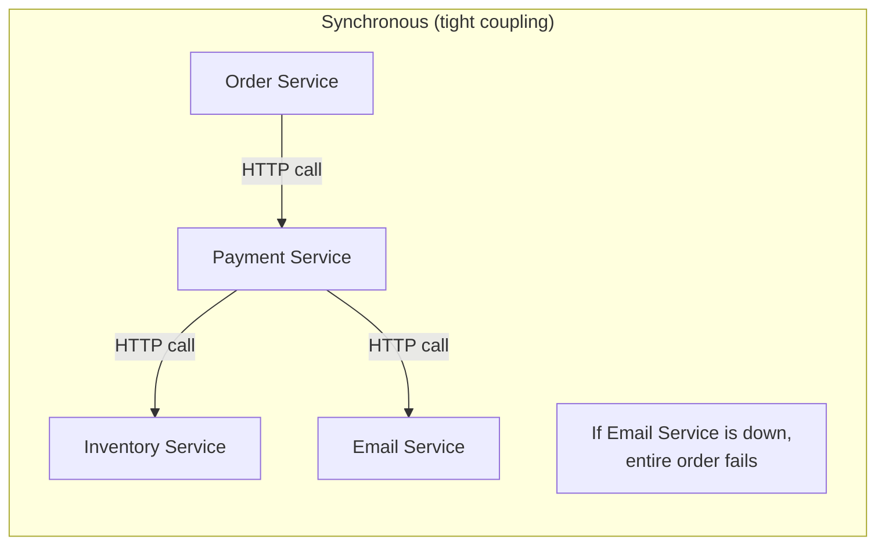

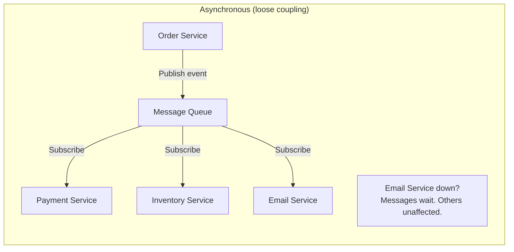

**Benefits of async messaging**:
- **Decoupling**: Services don't need to know about each other
- **Resilience**: Downstream failures don't cascade
- **Buffering**: Handles traffic spikes by absorbing bursts
- **Scalability**: Consumers scale independently

## Apache Kafka

### Architecture

Kafka is a **distributed commit log** designed for high-throughput, ordered event streaming:

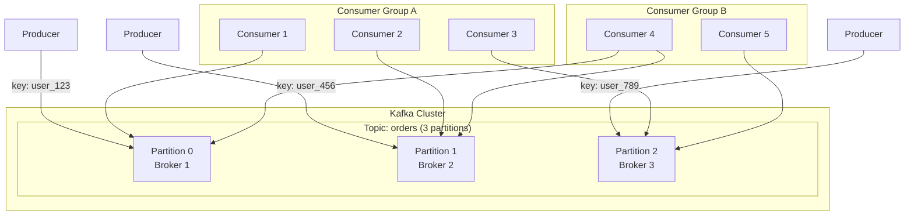

**Key concepts**:
- **Topic**: A named stream of records (like a database table)
- **Partition**: An ordered, immutable sequence of records. Provides parallelism.
- **Consumer Group**: A set of consumers that cooperatively read partitions. Each partition is consumed by exactly one consumer in the group.
- **Offset**: A sequential ID for each record in a partition. Consumers track their position.

### Kafka's Guarantees

```
Ordering: Guaranteed WITHIN a partition (not across partitions)
Durability: Configurable replication factor (typically 3)
Retention: Time-based (7 days default) or size-based
Delivery: At-least-once (default), exactly-once with transactions
```

### When to Use Kafka

- Event streaming (user activity, logs, metrics)
- Event sourcing (storing the full history of changes)
- Stream processing (real-time aggregations, windowing)
- Data pipeline (ETL, moving data between systems)
- High-throughput scenarios (millions of messages/second)

## RabbitMQ

### Architecture

RabbitMQ is a **traditional message broker** implementing AMQP, focused on flexible routing and delivery guarantees:

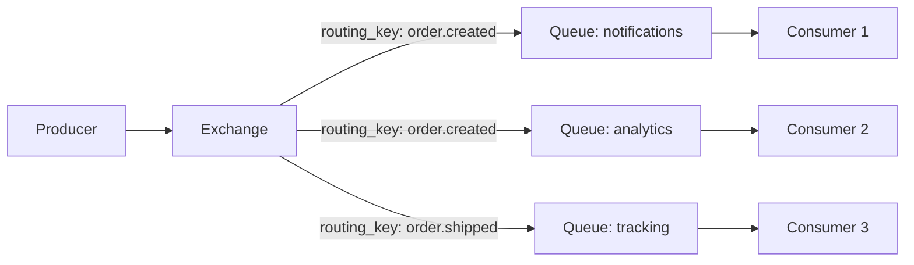

**Exchange types**:
- **Direct**: Routes by exact routing key match
- **Topic**: Routes by routing key pattern (`order.*`, `#.error`)
- **Fanout**: Broadcasts to all bound queues
- **Headers**: Routes based on message headers

### RabbitMQ vs. Kafka

| Feature | Kafka | RabbitMQ |
|---------|-------|----------|
| **Model** | Distributed log | Message broker |
| **Message retention** | Retained after consumption | Deleted after ACK |
| **Ordering** | Per partition | Per queue |
| **Routing** | Topic + partition key | Flexible exchange routing |
| **Replay** | Yes (seek to any offset) | No (message consumed once) |
| **Throughput** | Very high (millions/sec) | Moderate (tens of thousands/sec) |
| **Best for** | Event streaming, data pipelines | Task queues, request-reply |
| **Complexity** | Higher (cluster management) | Lower (simpler operations) |

## Amazon SQS

### Standard vs. FIFO

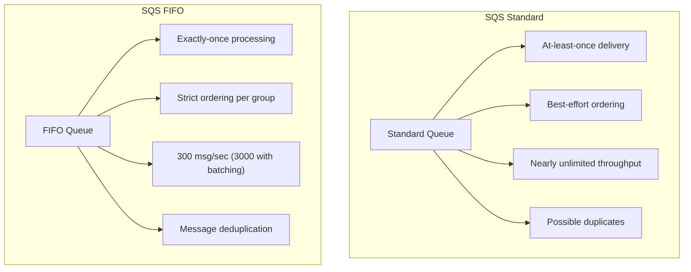

**SQS advantages**: Fully managed, no servers to operate, automatic scaling, pay-per-message pricing. Ideal for cloud-native architectures on AWS.

## Message Delivery Guarantees

### The Three Levels

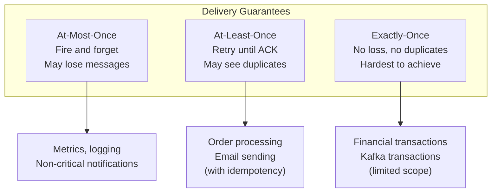

### At-Least-Once with Idempotency

The practical approach: accept duplicates, make consumers idempotent:

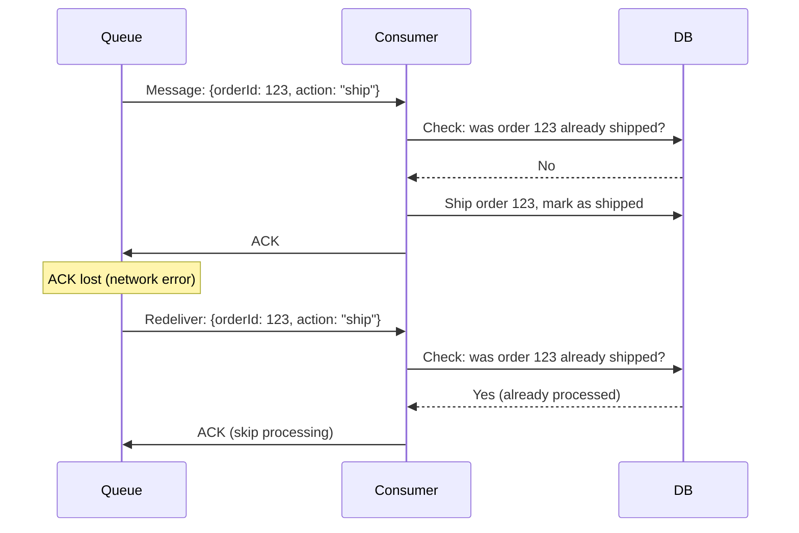

### Exactly-Once in Kafka

Kafka achieves exactly-once semantics using **idempotent producers** and **transactions**:

```
Idempotent producer:
  - Each producer gets a unique ID
  - Each message gets a sequence number
  - Broker deduplicates by (producer_id, sequence_number)

Kafka transactions:
  - Atomic writes across multiple partitions
  - read-process-write patterns with exactly-once
  - Requires all consumers to read "read_committed" isolation
```

This is limited to Kafka-to-Kafka pipelines. Once you leave Kafka (write to a database, call an API), you're back to at-least-once.

## Event-Driven Architecture Patterns

### Event Sourcing

Store **every state change as an event**, not just the current state:

```
Traditional: UPDATE account SET balance = 950 WHERE id = 123

Event Sourcing:
  Event 1: AccountCreated {id: 123, balance: 1000}
  Event 2: MoneyWithdrawn {id: 123, amount: 50}
  Current state: Replay events → balance = 950
```

**Benefits**: Full audit trail, ability to rebuild state, temporal queries ("what was the balance yesterday?").

### CQRS (Command Query Responsibility Segregation)

Separate the write model from the read model:

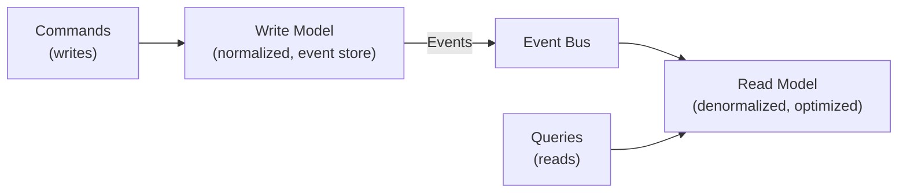

**Why**: Write-optimized storage (normalized, ACID) and read-optimized storage (denormalized, fast) serve different needs. CQRS lets you optimize each independently.

### Dead Letter Queue (DLQ)

Messages that repeatedly fail processing go to a DLQ for investigation:

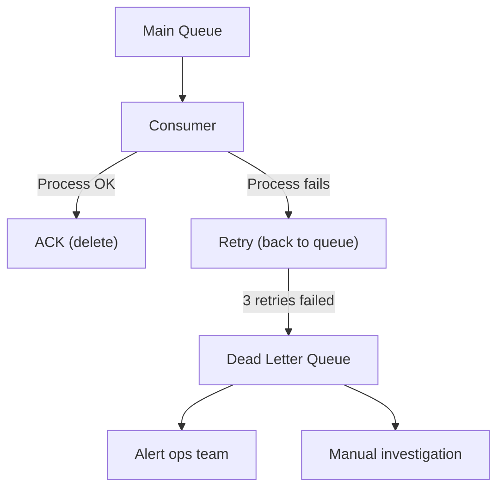

**Configure**: Max retry count (3-5), DLQ retention (14 days), alerting on DLQ depth.

### Backpressure

When consumers can't keep up with producers:

```
Without backpressure:
  Producer: 10,000 msg/sec
  Consumer: 5,000 msg/sec
  Queue grows: 5,000 msg/sec × 3600 sec = 18M messages/hour
  → Queue fills up, OOM, crash

With backpressure:
  Option 1: Producer slows down (rate limiting)
  Option 2: Add more consumers (auto-scaling)
  Option 3: Drop low-priority messages (load shedding)
  Option 4: Apply back-pressure (TCP flow control in Kafka)
```

## Real-World Examples

### LinkedIn (Kafka Origin)

Kafka was built at LinkedIn for handling their activity stream. Today LinkedIn processes:
- 7+ trillion messages per day
- 100+ Kafka clusters
- Used for: activity tracking, metrics, data pipelines, stream processing

### Uber

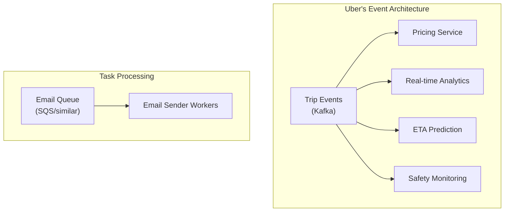

Uber uses Kafka for real-time event streaming (trip events, driver locations) and task queues for async work (emails, push notifications, receipt generation).

## Trade-Off Analysis

### Choosing the Right System

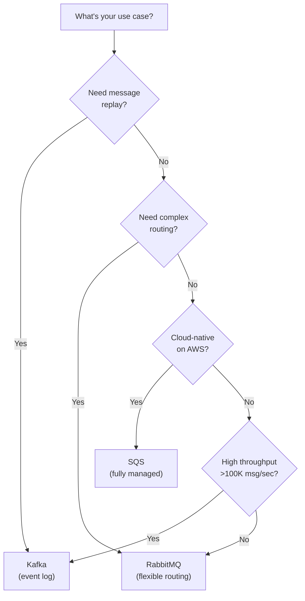

## Capacity Estimation

For a notification system sending 1M notifications/day:

```
Message rate:
  1M/day = ~12 messages/sec (average)
  Peak: 10x average = 120 messages/sec

Kafka cluster sizing (if using Kafka):
  120 msg/sec is tiny for Kafka → 1 broker is sufficient
  Use 3 brokers for fault tolerance
  3 partitions for the topic

Queue depth for bursts:
  If consumer processes 50 msg/sec, and burst is 120 msg/sec:
  Backlog builds at 70 msg/sec during burst
  10-minute burst = 42,000 messages queued
  Storage: 42K × 1KB = ~42 MB (trivial)
```

## Interview Approach

1. **Identify async workflows**: "Payment processing doesn't need to block the API response"
2. **Choose the right tool**: Kafka for events, RabbitMQ/SQS for tasks
3. **Address delivery guarantees**: "At-least-once with idempotent consumers"
4. **Handle failures**: "DLQ for poison messages, exponential backoff for retries"
5. **Consider ordering**: "Messages with the same user_id go to the same partition for ordering"
6. **Plan for scale**: "Consumer group auto-scales based on partition lag"

> **Pro tip**: Don't just say "we'll use a message queue." Specify *which* queue and *why*. "We'll use Kafka for the activity stream because we need replay capability and high throughput, and SQS for email sending because it's simpler and we don't need ordering."

## Key Takeaways

1. **Queues decouple services**: Producer doesn't need to know about consumers. Failures don't cascade.
2. **Kafka is a log, not a queue**: Messages are retained and replayable. Multiple consumer groups read independently.
3. **At-least-once + idempotency**: The pragmatic choice for most systems. Exactly-once is limited to specific scenarios.
4. **DLQs are mandatory**: Always have a plan for messages that can't be processed.
5. **Ordering requires partitioning**: Kafka guarantees order per partition, not per topic. Use the right partition key.
6. **Choose by use case**: Kafka for streaming/events, RabbitMQ for routing/tasks, SQS for cloud-native simplicity.

## External Resources

- [Apache Kafka Documentation](https://kafka.apache.org/documentation/)
- [RabbitMQ Tutorials](https://www.rabbitmq.com/getstarted.html)
- [AWS SQS Developer Guide](https://docs.aws.amazon.com/AWSSimpleQueueService/latest/SQSDeveloperGuide/)
- [Designing Event-Driven Systems (Confluent)](https://www.confluent.io/designing-event-driven-systems/)
- [Martin Kleppmann — Turning the Database Inside Out](https://www.confluent.io/blog/turning-the-database-inside-out-with-apache-samza/)
- [Uber Engineering — Building Reliable Reprocessing](https://eng.uber.com/reliable-reprocessing/)
